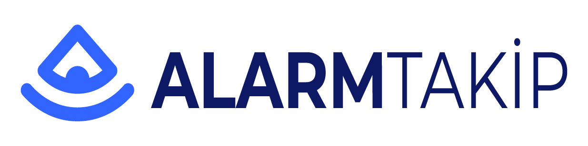

<!-- Improved compatibility of back to top link: See: https://github.com/othneildrew/Best-README-Template/pull/73 -->

<!--
*** Thanks for checking out the Best-README-Template. If you have a suggestion
*** that would make this better, please fork the repo and create a pull request
*** or simply open an issue with the tag "enhancement".
*** Don't forget to give the project a star!
*** Thanks again! Now go create something AMAZING! :D
-->

<!-- PROJECT SHIELDS -->
<!--
*** I'm using markdown "reference style" links for readability.
*** Reference links are enclosed in brackets [ ] instead of parentheses ( ).
*** See the bottom of this document for the declaration of the reference variables
*** for contributors-url, forks-url, etc. This is an optional, concise syntax you may use.
*** https://www.markdownguide.org/basic-syntax/#reference-style-links
-->
<!--
[![Contributors][contributors-shield]][contributors-url]
[![Forks][forks-shield]][forks-url]
[![Stargazers][stars-shield]][stars-url]
[![Issues][issues-shield]][issues-url]
[![MIT License][license-shield]][license-url]
[![LinkedIn][linkedin-shield]][linkedin-url]
-->

<!-- PROJECT LOGO -->
 

  

 <!-- <h3 align="center">Best-README-Template</h3>

  

    An awesome README template to jumpstart your projects!
     
    <a href="https://github.com/othneildrew/Best-README-Template"><strong>Explore the docs »</strong></a>
     
     
    <a href="https://github.com/othneildrew/Best-README-Template">View Demo</a>
    ·
    <a href="https://github.com/othneildrew/Best-README-Template/issues">Report Bug</a>
    ·
    <a href="https://github.com/othneildrew/Best-README-Template/issues">Request Feature</a>
  
 -->

<!-- TABLE OF CONTENTS

  
Table of Contents

  <ol>
    <li>
      <a href="#about-the-project">About The Project</a>
      <ul>
        <li><a href="#built-with">Built With</a></li>
      </ul>
    </li>
    <li>
      <a href="#getting-started">Getting Started</a>
      <ul>
        <li><a href="#prerequisites">Prerequisites</a></li>
        <li><a href="#installation">Installation</a></li>
      </ul>
    </li>
    <li><a href="#usage">Usage</a></li>
    <li><a href="#roadmap">Roadmap</a></li>
    <li><a href="#contributing">Contributing</a></li>
    <li><a href="#license">License</a></li>
    <li><a href="#contact">Contact</a></li>
    <li><a href="#acknowledgments">Acknowledgments</a></li>
  </ol>

-->

<!-- ABOUT THE PROJECT -->
## Proje Hakkında

[![Product Name Screen Shot][product-screenshot]](https://alarmtakip.com)

Neden:
* 16 Yıllık Alarm Takip Merkezi deneyimimi aktarmak.
* Alternatif bir yazılım ihtiyacının olması.
* IoT ekosistemi içine girmek.
* 30 Yaşından sonra yazılım ve sistem ile ilgilenirken artık ciddi bir proje yapma isteği :smile:

### Kullandığım Teknoloji ve Kütüphaneler

[![Docker][Docker]][Docker-url]
[![.NET][.NET]][.NET-url]
[![MariaDB][MariaDB]][MariaDB-url]
[![RabbitMQ][RabbitMQ]][RabbitMQ-url]
[![Mosquitto][Mosquitto]][Mosquitto-url]
[![Redis][Redis]][Redis-url]
[![Nginx][Nginx]][Nginx-url]
[![Ocelot][Ocelot]][Ocelot-url]
[![Swagger][Swagger]][Swagger-url]
[![gRPC][gRPC]][gRPC-url]
[![mediatR][mediatR]][mediatR-url]
[![Angular][Angular]][Angular-url]
[![Flutter][Flutter]][Flutter-url]
[![Dart][Dart]][Dart-url]
[![FluentValidation][FluentValidation]][FluentValidation-url]
[![Azure Notification Hub][AzureNotificationHub]][AzureNotificationHub-url]
[![FirebaseCloudMessaging][FirebaseCloudMessaging]][FirebaseCloudMessaging-url]

### Servislerde kullandığım teknik yapılar
* CQRS (MediatR (Command,Query,Pipeline))
* Domain Driven Design
* IOC (AutoFac)
* Mapping (AutoMapper)
* Fluent Validation
* TCP/IP ve ComPort Haberleşme
* MQTT + JWT
* TimeOut Service (Redis)

### AUTH Katmanı ve senaryoları benim tarafımdan yazılmıştır.

<!-- ROADMAP -->
<!--## Yol Haritası

- [x] Changelog Ekle.
- [x] Projede kullanacağın teknolojileri tespit et.
- [x] Teknolojiler ile basit uygulamalar yap yada örnek kodlar üzerinde testler gerçekleştir.
- [x] TCP/IP / Comport Katmanını hazırla.
- [x] 
- [ ] Add Additional Templates w/ Examples
- [ ] Add "components" document to easily copy & paste sections of the readme
- [ ] Multi-language Support
    - [ ] Chinese
    - [ ] Spanish

See the [open issues](https://github.com/othneildrew/Best-README-Template/issues) for a full list of proposed features (and known issues).

(<a href="#readme-top">back to top</a>)
 -->

<!-- CONTACT -->
## Contact

Mustafa Sinan KOCA -  mustafasinankoca@gmail.com

(<a href="#readme-top">back to top</a>)

<!--# Changelog

## v1.0.0

### Added or Changed
- Added this changelog :)
- Fixed typos in both templates
- Back to top links
- Added more "Built With" frameworks/libraries
- Changed table of contents to start collapsed
- Added checkboxes for major features on roadmap

### Removed

- Some packages/libraries from acknowledgements I no longer use
 -->
<!-- ACKNOWLEDGMENTS -->
## Yararlı Bağlantılar

* [.NET Microservices Sample Reference Application](https://github.com/dotnet-architecture/eShopOnContainers)

(<a href="#readme-top">back to top</a>)

<!-- MARKDOWN LINKS & IMAGES -->
<!-- https://www.markdownguide.org/basic-syntax/#reference-style-links -->
[contributors-shield]: https://img.shields.io/github/contributors/othneildrew/Best-README-Template.svg?style=for-the-badge
[contributors-url]: https://github.com/othneildrew/Best-README-Template/graphs/contributors
[forks-shield]: https://img.shields.io/github/forks/othneildrew/Best-README-Template.svg?style=for-the-badge
[forks-url]: https://github.com/othneildrew/Best-README-Template/network/members
[stars-shield]: https://img.shields.io/github/stars/othneildrew/Best-README-Template.svg?style=for-the-badge
[stars-url]: https://github.com/othneildrew/Best-README-Template/stargazers
[issues-shield]: https://img.shields.io/github/issues/othneildrew/Best-README-Template.svg?style=for-the-badge
[issues-url]: https://github.com/othneildrew/Best-README-Template/issues
[license-shield]: https://img.shields.io/github/license/othneildrew/Best-README-Template.svg?style=for-the-badge
[license-url]: https://github.com/othneildrew/Best-README-Template/blob/master/LICENSE.txt
[linkedin-shield]: https://img.shields.io/badge/-LinkedIn-black.svg?style=for-the-badge&logo=linkedin&colorB=555
[linkedin-url]: https://linkedin.com/in/othneildrew
[product-screenshot]: images/screenshot.png

[Docker]:https://img.shields.io/badge/docker-%230db7ed.svg?style=for-the-badge&logo=docker&logoColor=white
[Docker-url]: https://docker.com/
[.NET]:https://img.shields.io/badge/.NET-5C2D91?style=for-the-badge&logo=.net&logoColor=white
[.NET-url]: https://dotnet.microsoft.com/en-us/
[RabbitMQ]:https://img.shields.io/badge/Rabbitmq-FF6600?style=for-the-badge&logo=rabbitmq&logoColor=white
[RabbitMQ-url]: https://www.rabbitmq.com
[Mosquitto]:https://img.shields.io/badge/mosquitto-%233C5280.svg?style=for-the-badge&logo=eclipsemosquitto&logoColor=white
[Mosquitto-url]: https://mosquitto.org
[Redis]:https://img.shields.io/badge/redis-%23DD0031.svg?style=for-the-badge&logo=redis&logoColor=white
[Redis-url]: https://redis.io
[Nginx]:https://img.shields.io/badge/nginx-%23009639.svg?style=for-the-badge&logo=nginx&logoColor=white
[Nginx-url]: https://www.nginx.com
[Ocelot]:https://img.shields.io/badge/ocelot.gateway-000000?style=for-the-badge&logo=ocelot&logoColor=white
[Ocelot-url]: https://github.com/threemammals/ocelot
[Swagger]:https://img.shields.io/badge/-Swagger-%23Clojure?style=for-the-badge&logo=swagger&logoColor=white
[Swagger-url]: https://swagger.io
[gRPC]:https://img.shields.io/badge/GRPC-5ac5c5?style=for-the-badge&logo=grpc&logoColor=white
[gRPC-url]: https://grpc.io
[mediatR]:https://img.shields.io/badge/MediatR-1695CA?style=for-the-badge&logo=MediatR&logoColor=white
[mediatR-url]: https://github.com/jbogard/MediatR
[Angular]:https://img.shields.io/badge/angular-%23DD0031.svg?style=for-the-badge&logo=angular&logoColor=white
[Angular-url]: https://angular.io
[Flutter]:https://img.shields.io/badge/Flutter-%2302569B.svg?style=for-the-badge&logo=Flutter&logoColor=white
[Flutter-url]: https://flutter.dev
[Dart]:https://img.shields.io/badge/dart-%230175C2.svg?style=for-the-badge&logo=dart&logoColor=white
[Dart-url]: https://dart.dev
[FluentValidation]:https://img.shields.io/badge/FluentValidation-FF0000.svg?style=for-the-badge&logo=FluentValidation&logoColor=white
[FluentValidation-url]: https://github.com/FluentValidation/FluentValidation
[AzureNotificationHub]:https://img.shields.io/badge/AzureNotificationHub-%230072C6.svg?style=for-the-badge&logo=microsoftazure&logoColor=white
[AzureNotificationHub-url]: https://azure.microsoft.com/en-us/products/notification-hubs/#overview
[FirebaseCloudMessaging]:https://img.shields.io/badge/FirebaseCloudMessaging-%23039BE5.svg?style=for-the-badge&logo=firebase
[FirebaseCloudMessaging-url]: https://firebase.google.com/docs/cloud-messaging
[MariaDB]:https://img.shields.io/badge/MariaDB-003545?style=for-the-badge&logo=mariadb&logoColor=white
[MariaDB-url]: [https://firebase.google.com/docs/cloud-messaging](https://mariadb.org)

